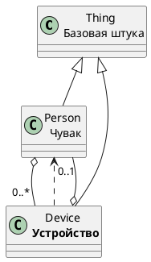


# Описание

Minimal diverse HJSON example for Markdown generation

# Статистика

| Наименование | Количество |
|--------------|------------|
| Классы       | 3 |
| Перечисления | 1 |
| Примитивы    | 1 |
| Типы данных  | 1 |
| Составные типы | 1 |

# Полная диаграмма классов

# Классы

## Легенда
🟦 - класс  
🟪 - перечисление  
🟧 - примитив  
🟨 - тип данных  
🟥 - составной тип  

| Идентификатор | Наименование | Описание |
|---------------|--------------|----------|
| 🟧 [String](./entities/String.md) | Строка | Primitive text value |
| 🟨 [Date](./entities/Date.md) | Дата | Date value |
| 🟪 [StatusKind](./entities/StatusKind.md) | Device status enum | Device lifecycle states |
| 🟥 [GeoPoint](./entities/GeoPoint.md) | Geo point compound | Compound coordinates value |
| 🟦 [Thing](./entities/Thing.md) | Базовая штука | Base domain entity |
| 🟦 [Person](./entities/Person.md) | Чувак | Person who owns devices |
| 🟦 [Device](./entities/Device.md) | **Устройство** | Trackable device |

Сделано с помощью [SimpleOntoDoc](https://github.com/simplepersonru/SimpleOntoDoc)      
