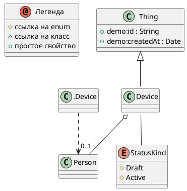


# Описание

Trackable device

# Сводка

| Ключ    | Значение |
|-----------------|------------|
| Тип             | 🟦 Class |
| namespace       | demo |
| Базовый класс | [Thing](Thing.md) |

# Диаграмма

# Свойства

| Идентификатор  | Тип  | Количество | Ограничения | Описание |
|----------------|------|------------|------------|-----------|
| <a name="status"/> status | 🟪 [StatusKind](StatusKind.md) | 1 |  | Current status |
| <a name="owner"/> owner | 🟦 [Person](Person.md) | 0..1 |  | Device owner |
| <a name="location"/> location | 🟥 [GeoPoint](GeoPoint.md) | 0..1 |  | Current location |

# Все свойства (включая унаследованные)

| Идентификатор | Тип | Количество| Ограничения | Описание |
| ---------------| -----| --------|--------------|  ----------|
| [Thing](Thing.md).id |  🟧 [String](String.md) | 1 | pattern = ^[A-Z0-9_-]{3,20}$;   | External identifier |
| [Thing](Thing.md).createdAt |  🟨 [Date](Date.md) |  |  | Creation timestamp |
| [Device](Device.md).status |  🟪 [StatusKind](StatusKind.md) | 1 |  | Current status |
| [Device](Device.md).owner |  🟦 [Person](Person.md) | 0..1 |  | Device owner |
| [Device](Device.md).location |  🟥 [GeoPoint](GeoPoint.md) | 0..1 |  | Current location |

# Ссылки

| Свойство | Описание |
| ----------| ----------|
| [Person](Person.md).devices | Owned devices |

Сделано с помощью [SimpleOntoDoc](https://github.com/simplepersonru/SimpleOntoDoc)  