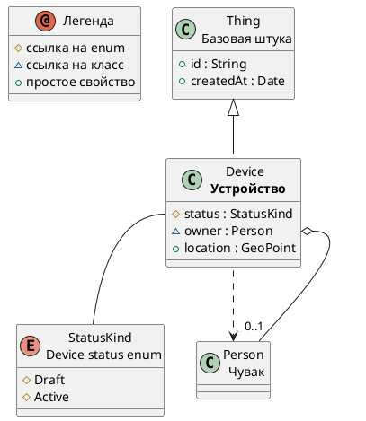


# Описание

**Устройство**  
Trackable device

# Сводка

| Ключ    | Значение |
|-----------------|------------|
| Тип             | 🟦 Class |
| namespace       | demo |
| Базовый класс | [Thing](Thing.md) |
| Свойств | 3 |
| Всех свойств | 5 |
| Дочерних классов | 0 |
| Ссылок       | 1 |

# Диаграмма

# Свойства

| Идентификатор  | Тип  | Ограничения | Display  | Описание  |
|----------------|------|------------ |-----------|-----------|
| <a name="status"/> [status](Device.md#status) | 🟪 [StatusKind](StatusKind.md) | _multiplicity_: 1   |  | Current status |
| <a name="owner"/> [owner](Device.md#owner) | 🟦 [Person](Person.md) | _multiplicity_: 0..1   |  | Device owner |
| <a name="location"/> [location](Device.md#location) | 🟥 [GeoPoint](GeoPoint.md) | _multiplicity_: 0..1   |  | Current location |

# Все свойства (включая унаследованные)

| Идентификатор | Тип   |  Ограничения  | Display   |  Описание |
| ---------------| -----| --------------|  ----------| ----------|
| [Thing.id](Thing.md#id) |  🟧 [String](String.md) | _multiplicity_: 1  _pattern_: ^[A-Z0-9_-]{3,20}$   |  | External identifier |
| [Thing.createdAt](Thing.md#createdAt) |  🟨 [Date](Date.md) |  |  | Creation timestamp |
| [Device.status](Device.md#status) |  🟪 [StatusKind](StatusKind.md) | _multiplicity_: 1   |  | Current status |
| [Device.owner](Device.md#owner) |  🟦 [Person](Person.md) | _multiplicity_: 0..1   |  | Device owner |
| [Device.location](Device.md#location) |  🟥 [GeoPoint](GeoPoint.md) | _multiplicity_: 0..1   |  | Current location |

# Ссылки

| Свойство  | Display  | Описание |
| ----------| ----------|----------|
| [Person.devices](Person.md#devices) |  | Owned devices |

---
-  
-  
-  
-  
-  
-  
-  
-  
-  
-  
-  
-  
-  
-  
-  
- пропуск места, чтобы ссылки попадали куда надо
-  
-  
-  
-  
-  
-  
-  
-  
-  
-  
-  
-  
-  
-  
-  
-  
-  
-  

Сделано с помощью [SimpleOntoDoc](https://github.com/simplepersonru/SimpleOntoDoc)  