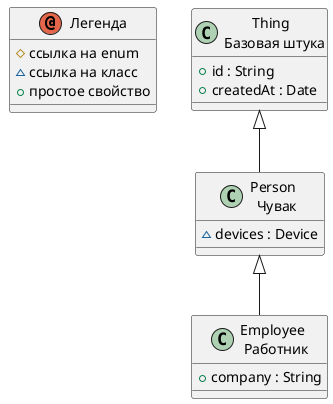


# Описание

Работник  
Работяга, который может владеть устройствами

# Сводка

| Ключ    | Значение |
|-----------------|------------|
| Тип             | 🟦 Class |
| namespace       | demo |
| Базовый класс | [Person](Person.md) |
| Свойств | 1 |
| Всех свойств | 4 |
| Дочерних классов | 0 |
| Ссылок       | 0 |

# Диаграмма

# Свойства

| Идентификатор  | Тип  | Ограничения | Display  | Описание  |
|----------------|------|------------ |-----------|-----------|
| <a name="company"/> [company](Employee.md#company) | 🟧 [String](String.md) |  |  | Компания, в которой работает сотрудник |

# Все свойства (включая унаследованные)

| Идентификатор | Тип   |  Ограничения  | Display   |  Описание |
| ---------------| -----| --------------|  ----------| ----------|
| [Thing.id](Thing.md#id) |  🟧 [String](String.md) | _multiplicity_: 1  _pattern_: ^[A-Z0-9_-]{3,20}$   |  | External identifier |
| [Thing.createdAt](Thing.md#createdAt) |  🟨 [Date](Date.md) |  |  | Creation timestamp |
| [Person.devices](Person.md#devices) |  🟦 [Device](Device.md) | _multiplicity_: 0..*   |  | Owned devices |
| [Employee.company](Employee.md#company) |  🟧 [String](String.md) |  |  | Компания, в которой работает сотрудник |

---
-  
-  
-  
-  
-  
-  
-  
-  
-  
-  
-  
-  
-  
-  
-  
- пропуск места, чтобы ссылки попадали куда надо
-  
-  
-  
-  
-  
-  
-  
-  
-  
-  
-  
-  
-  
-  
-  
-  
-  
-  

Сделано с помощью [SimpleOntoDoc](https://github.com/simplepersonru/SimpleOntoDoc)  