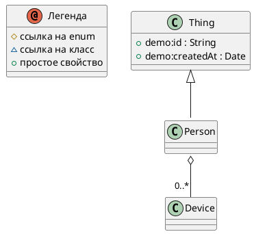


# Описание

Person who owns devices

# Сводка

| Ключ    | Значение |
|-----------------|------------|
| Тип             | 🟦 Class |
| namespace       | demo |
| Базовый класс | [Thing](Thing.md) |

# Диаграмма

# Свойства

| Идентификатор  | Тип  | Количество | Ограничения | Описание |
|----------------|------|------------|------------|-----------|
| <a name="devices"/> devices | 🟦 [Device](Device.md) | 0..* |  | Owned devices |

# Все свойства (включая унаследованные)

| Идентификатор | Тип | Количество| Ограничения | Описание |
| ---------------| -----| --------|--------------|  ----------|
| [Thing](Thing.md).id |  🟧 [String](String.md) | 1 | pattern = ^[A-Z0-9_-]{3,20}$;   | External identifier |
| [Thing](Thing.md).createdAt |  🟨 [Date](Date.md) |  |  | Creation timestamp |
| [Person](Person.md).devices |  🟦 [Device](Device.md) | 0..* |  | Owned devices |

# Ссылки

| Свойство | Описание |
| ----------| ----------|
| [Device](Device.md).owner | Device owner |

Сделано с помощью [SimpleOntoDoc](https://github.com/simplepersonru/SimpleOntoDoc)  