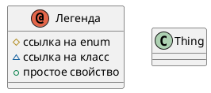


# Описание

Base domain entity

# Сводка

| Ключ    | Значение |
|-----------------|------------|
| Тип             | 🟦 Class |
| namespace       | demo |
| Базовый класс | - |

# Диаграмма

# Свойства

| Идентификатор  | Тип  | Количество | Ограничения | Описание |
|----------------|------|------------|------------|-----------|
| <a name="id"/> id | 🟧 [String](String.md) | 1 | pattern = ^[A-Z0-9_-]{3,20}$;   | External identifier |
| <a name="createdAt"/> createdAt | 🟨 [Date](Date.md) |  |  | Creation timestamp |

# Дочерние классы

| Идентификатор | Описание |
| ---------------| ----------|
| [Person](Person.md) | Person who owns devices |
| [Device](Device.md) | Trackable device |

Сделано с помощью [SimpleOntoDoc](https://github.com/simplepersonru/SimpleOntoDoc)  