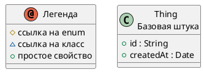


# Описание

Базовая штука  
Base domain entity

# Сводка

| Ключ    | Значение |
|-----------------|------------|
| Тип             | 🟦 Class |
| namespace       | demo |
| Базовый класс | - |
| Свойств | 2 |
| Всех свойств | 2 |
| Дочерних классов | 2 |
| Ссылок       | 0 |

# Диаграмма

# Свойства

| Идентификатор  | Тип  | Ограничения | Display  | Описание  |
|----------------|------|------------ |-----------|-----------|
| <a name="id"/> [id](Thing.md#id) | 🟧 [String](String.md) | _multiplicity_: 1  _pattern_: ^[A-Z0-9_-]{3,20}$   |  | External identifier |
| <a name="createdAt"/> [createdAt](Thing.md#createdAt) | 🟨 [Date](Date.md) |  |  | Creation timestamp |

# Дочерние классы

| Идентификатор  | Display  | Описание  |
| ---------------| ----------| ----------|
| [Person](Person.md) | Чувак | Person who owns devices |
| [Device](Device.md) | **Устройство** | Trackable device |

---
-  
-  
-  
-  
-  
-  
-  
-  
-  
-  
-  
-  
-  
-  
-  
- пропуск места, чтобы ссылки попадали куда надо
-  
-  
-  
-  
-  
-  
-  
-  
-  
-  
-  
-  
-  
-  
-  
-  
-  
-  

Сделано с помощью [SimpleOntoDoc](https://github.com/simplepersonru/SimpleOntoDoc)  